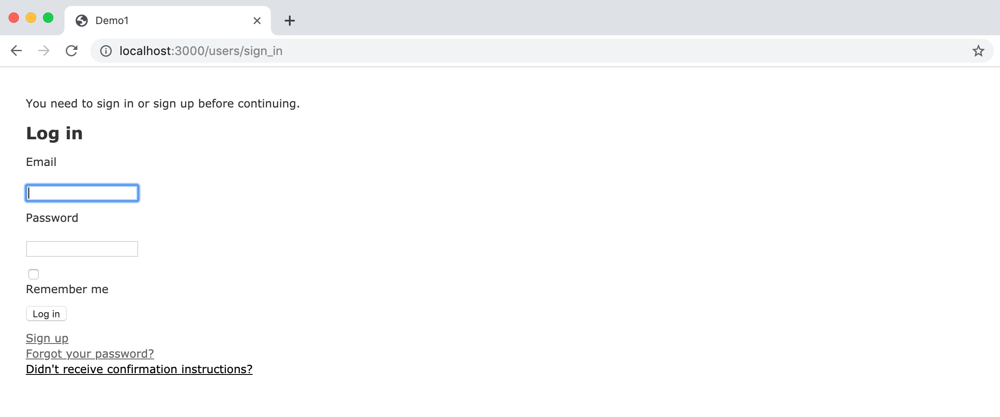
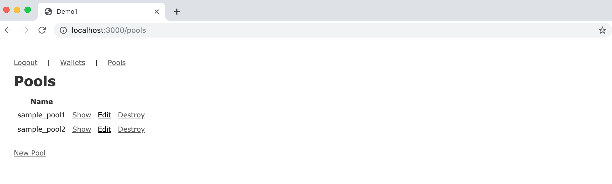
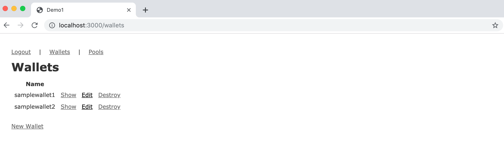

A very simple sample Ruby-on-Rails (Rails6) project using [aries-sdk-ruby](https://github.com/hyperledger/aries-sdk-ruby).

# Installation

    $ git clone https://github.com/johncallahan/aries-rails
    $ cd aries-rails
    $ bundle install
    $ export POSTGRES_USERNAME=<your PG account>
    $ export POSTGRES_PASSWORD=<your PG password>
    $ export HOSTNAME=localhost
    $ export HOSTPORT=3000
    $ export TEST_POOL_IP=<address of Indy node>
    $ export LIBRARY_PATH=/path/to/indy-sdk/libindy/target/debug/
    $ rake db:create
    $ rake db:migrate
    $ mailcatcher (optional - to catch signup emails)
    $ rails s

You will need an Indy node (see https://github.com/hyperledger/indy-sdk) for the TEST_POOL_IP and Postgres (I haven't tested SQLite or MySQL) running on the host.  Also, because of the dependency on libindy client (the LIBRARY_PATH environment variable), you cannot run this yet on Heroku (or Dokku) until an appropriate buildpack is available, but a development deploy works fine.

If the app starts successfully, navigate to http://localhost:3000/ (if deployed locally) and you'll see:

The app uses [devise](https://github.com/plataformatec/devise) for authentication.  Create an account via signup and login to see pool and wallets:

